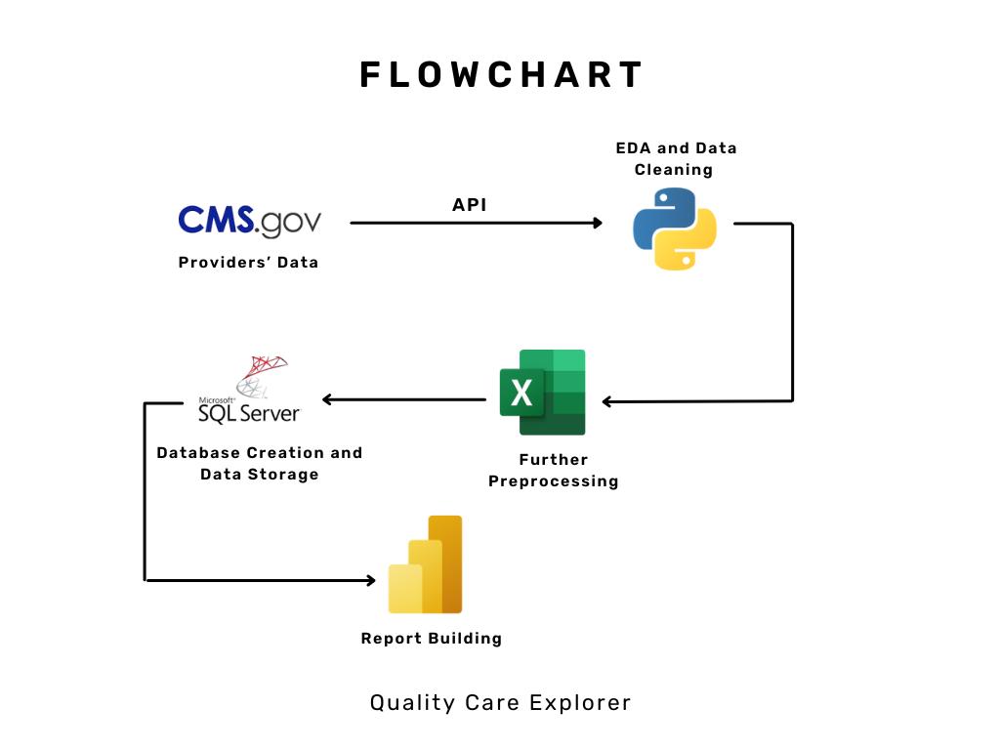
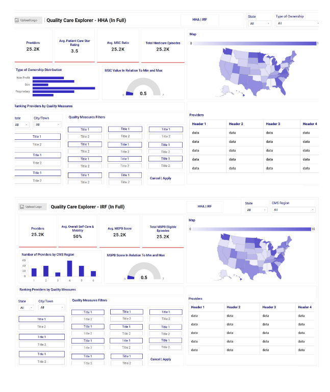
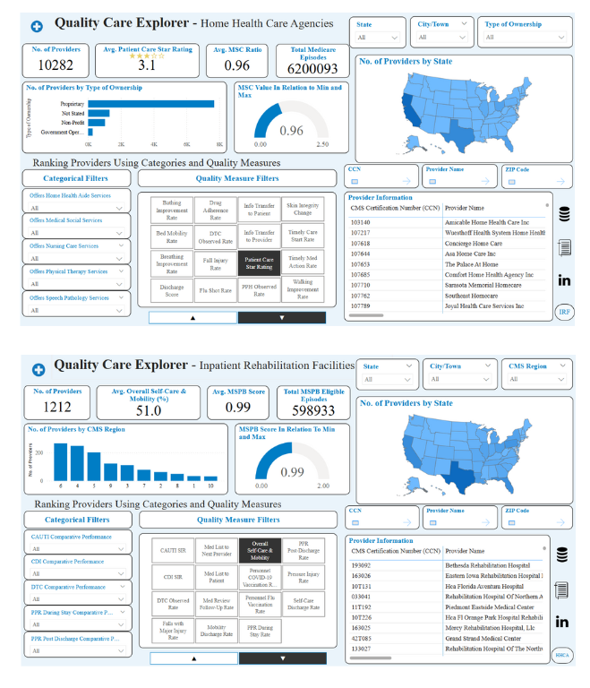

# Quality Care Explorer
# An End To End Healthcare Analytics Project


# Table of Contents 

- [Abstract](#Abstract)
- [Introduction/Background](#Introduction/Background)
- [Objective](#Objective)
- [Methodology](#Methodology)
  - [Flowchart](#Flowchart)
  - [Python](#Python)
  - [Excel](#Excel)
  - [Microsoft SQL Server](#MicrosoftSQLServer)
  - [Mockups Creation using Mokkup AI](#MockupsCreationusingMokkupAI)
  - [PowerBI](#PowerBI)
- [Results](#Results)
- [Conclusion](#Conclusion)
- [References](#References)

## Abstract
This end-to-end healthcare analytics project utilizes publicly available data from the Centers for Medicare & Medicaid Services (CMS) to deliver a performance insights platform focused on Home Health Care Agencies and Inpatient Rehabilitation Facilities across the United States. Leveraging technologies such as Python, Excel, Microsoft SQL Server, and Power BI, the project extracts, transforms, and visualizes healthcare quality measures to help users identify top-rated facilities based on criteria most important to them. The outcome is a dual-dashboard solution that supports transparency, comparison, and improved decision-making in healthcare services.

## Introduction/Background
### Centers for Medicare & Medicaid Services (CMS)
CMS is a federal agency within the Department of Health and Human Services responsible for administering Medicare, Medicaid, the Children's Health Insurance Program (CHIP), and the Health Insurance Marketplace. It also oversees data collection and reporting of healthcare provider quality metrics.
### Home Health Care Agencies (HHCA)
Home Health Agencies deliver a range of medical and non-medical services to patients in their homes. Their goal is to support recovery, manage chronic conditions, and promote patient independence. Common services include skilled nursing, physical and occupational therapy, speech-language services, and assistance with daily living tasks.
Inpatient Rehabilitation Facilities (IRF)
IRFs are specialized hospitals or hospital units that offer intensive rehabilitation services for individuals recovering from serious medical events such as strokes, surgeries, or traumatic injuries. These facilities aim to help patients regain function and reintegrate into daily life through structured, supervised programs.

## Objective 
The project seeks to create an interactive data-driven tool that enables users to evaluate and rank healthcare providers based on CMS quality metrics. By integrating various technologies and implementing user-centric design elements, the solution empowers both consumers and providers to make informed decisions, benchmark performance, and highlight areas for improvement.

## Methodology 
A multi-step process was employed to collect, clean, store, and visualize the data. Each stage is outlined below:

### Flowchart 


### Python 
Python served as the primary tool for data retrieval, exploratory analysis, and initial data transformation. Data was sourced directly from the CMS API, where quality measure codes were extracted, reshaped using pivot functions, and renamed for clarity. The snippet below illustrates the API request process:
```python
import requests
import pandas as pd

# Inpatient URL to download the dataset
inpatient_url = "https://data.cms.gov/provider-data/sites/default/files/resources/338f3022b522e13b6eb3c771aec03389_1733414708/Inpatient_Rehabilitation_Facility-Provider_Data_Dec2024.csv"

# Home Health Agencies
home_health_url = "https://data.cms.gov/provider-data/sites/default/files/resources/b1df2daa86922407689549b515d4635d_1733947506/HH_Provider_Jan2025.csv"

# Send a GET request to download the files
response1 = requests.get(inpatient_url)
response2 = requests.get(home_health_url)

# Check if request was successful
if response1.status_code == 200 and response2.status_code == 200:

    # Save the file locally
    with open('Inpatient_Rehabilitation_Facility_Provider_Data_Dec2024.csv', 'wb') as f1:
        f1.write(response1.content)
    print('file downloaded successfully.')
    
    with open('HH_Provider_Jan2025.csv', 'wb') as f2:
        f2.write(response2.content)
    print('file downloaded successfully.')

    # Load the CSV file into a DataFrame
    inpatient_df = pd.read_csv('Inpatient_Rehabilitation_Facility_Provider_Data_Dec2024.csv')
    home_health_df = pd.read_csv('HH_Provider_Jan2025.csv')

    # Display the first few rows of the DataFrame
    print(inpatient_df.head())
    print(home_health_df.head())
else:
    print(f'Error: {response1.status_code} - {response1.text}')
```

### Excel 
Cleaned datasets were exported to Excel for additional data wrangling, such as duplicate removal and quality checks. This step facilitated easier data inspection and allowed for minor formatting adjustments before database loading.

### Microsoft SQL Server
A structured database environment was created to store the finalized data tables. This step ensured seamless data refresh and scalability of the reporting solution.

### Mockups Creation using Mokkup AI 
To guide report development, mockups were designed using Mokkup AI. These prototypes served as blueprints for visual layout and helped plan an intuitive user interface. Two separate mockups were crafted—one for Home Health Care Agencies and another for IRFs—to reflect the unique metrics of each provider type.


### PowerBI 
The final interactive dashboards were developed using Power BI. Two report pages were created, each highlighting performance metrics for one provider type. Slicers, dynamic rankings, and sort-direction toggles were implemented to enhance user experience. A custom ranking logic was embedded using DAX. Below is a sample ranking expression:
```powerbi
Rank_IRF = 
RANKX(
    ALLSELECTED(IRF),
    CALCULATE(SELECTEDVALUE(IRF[Overall_Self_Care_Mobility])),
    ,
    DESC,
    DENSE
)
```
## Results
The resulting Power BI reports offer a comprehensive view of CMS-certified providers nationwide. Users can filter by state, explore provider-specific performance, and sort based on selected metrics. The ranking system provides actionable insights: healthcare consumers can locate top-rated facilities near them, while providers can assess internal performance and benchmark against peers. The tool supports both operational transparency and quality-driven improvement.


[View and Explore the Quality Care Explorer](https://app.powerbi.com/view?r=eyJrIjoiOTgwOTI5NTYtOTFjYy00MTM1LWE5OWUtYTlhM2E5Y2JhODRiIiwidCI6ImJjNDg4ZDAzLTUwNGYtNGZjMy1iOTFmLTM0YjJmNjc0ZWQyZiIsImMiOjN9)

## Conclusion
The Quality Care Explorer delivers a practical, data-driven resource for evaluating healthcare providers in the U.S. By integrating open CMS data with modern analytics tools, the project fosters informed decision-making among patients, families, and care providers. The interactive dashboards not only visualize critical quality measures but also empower stakeholders to interpret and act upon the data in meaningful ways.

## References
[CMS.gov Provider Catalog](https://data.cms.gov/provider-data/)
[Stephen | Data - Excel to Power BI Portfolio Project | Full End-to-End Data Project](https://www.youtube.com/watch?v=mm_sN-Elplg&t=8895s)
[Mokkup.ai](https://app.mokkup.ai/)


